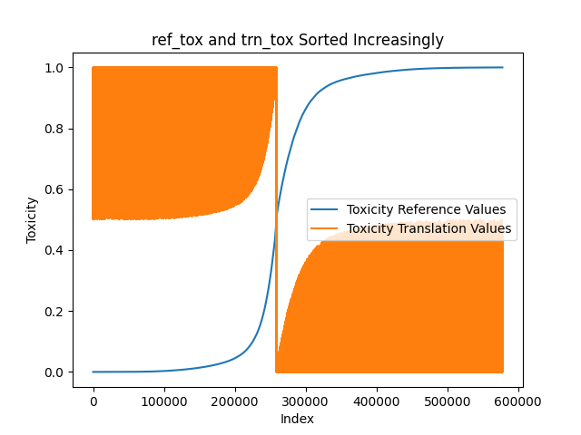
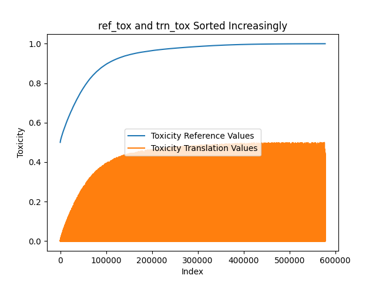

# Final Solution Report

## Introduction

For the Text Detoxification problem we were given a ParaNMT dataset with 500K samples of texts toxic and non-toxic texts with their charactersitics. The task was to build a model that can turn toxic text into a neutral, non-toxic one preserving the text context.

## Data analysis

Pandas and matplotlib were used to make a proper data analysis. It turns out that given dataset has issues with swapped samples (their toxicity levels were swapped). Data were check for NaNs, maximum lenghts of texts were computed, and swapping was applied so that `reference` text always had toxicity level higher than `translation`. The plot of sample toxicities before and after preprocessing are provided below:

## Model Specification

## Training Process

## Evaluation

To evaluate all methods that were used I implemented evaluation of metrics:

1. [Style Transfer Accuracy](https://github.com/s-nlp/detox/blob/0ebaeab817957bb5463819bec7fa4ed3de9a26ee/emnlp2021/metric/metric.py#L27) — computes average score from [Roberta Toxicity Classifier by s-nlp](https://huggingface.co/s-nlp/roberta_toxicity_classifier).
2. [BLEU Score](https://huggingface.co/spaces/evaluate-metric/bleu) — compares predicted text with translations, so that "the closer a predicted text is to a translation, the better it is".

Also, the results of models performance were accessed manually for sanity check and training improvement.

## Results

The best method is METHOD. It achieved Style Transfer Accuracy and BLEU Score.